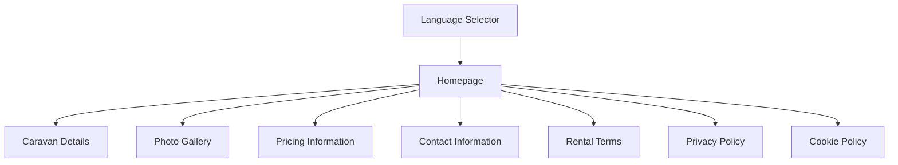
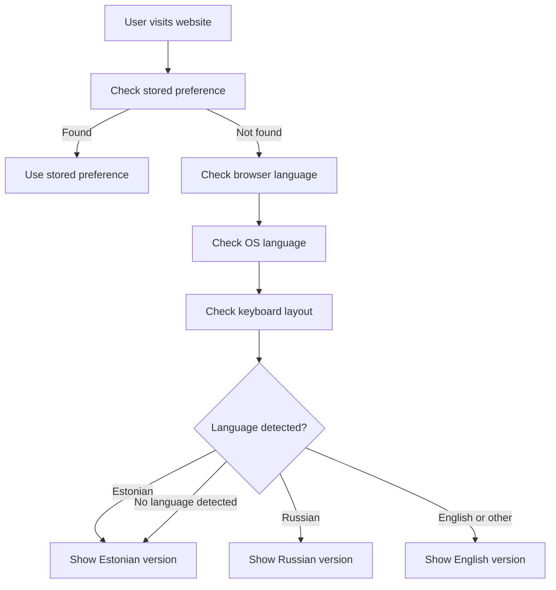
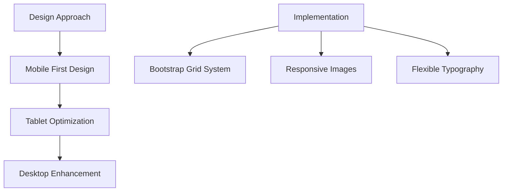

# Multilingual Caravan Rental Website Plan

## 1. Project Overview

We'll create a responsive, multilingual website for renting an Elddis Corona 490/5 caravan (2006 model) based in Tartu, South Estonia. The website will:
- Support three languages: Estonian, Russian, and English
- Automatically detect the user's language preference using browser, OS, and keyboard information
- Default to Estonian if no language is detected
- Display caravan specifications, photos, pricing, and contact information
- Include persuasive content to encourage rentals
- Be responsive and modern-looking on all devices
- Be implemented with a lightweight, fast-loading technology stack
- Include necessary legal pages (Privacy Policy, Cookie Policy, Rental Terms)
- Use only essential cookies for language preference

## 2. Technology Stack

Based on your requirements for a fast-loading, responsive, and easy-to-maintain website, I recommend:

### Frontend
- **HTML5**: For structure
- **CSS3**: For styling with modern features
- **Vanilla JavaScript**: For interactivity and language detection/switching
- **Bootstrap 5**: For responsive design framework (lightweight and widely supported)
- **Font Awesome**: For icons (optional)

This stack offers:
- Fast loading times (minimal dependencies)
- Excellent cross-device compatibility
- Easy maintenance
- No backend requirements (static site)

## 3. Site Structure



### Pages/Sections
1. **Homepage**: Overview with hero image, persuasive content, and quick access to all sections
2. **Caravan Details**: Specifications and features of the Elddis Corona 490/5
3. **Photo Gallery**: Multiple images of the caravan from different angles
4. **Pricing Information**: Daily/weekly rates and rental terms
5. **Contact Information**: How to inquire about renting the caravan
6. **Rental Terms**: Detailed terms and conditions for renting the caravan
7. **Privacy Policy**: Information about data collection and usage
8. **Cookie Policy**: Information about essential cookies used on the website
9. **Language Selector**: Visible on all pages for manual language switching

## 4. Language Implementation

### Enhanced Automatic Language Detection


### Implementation Details
- Use JavaScript's `navigator.language` and `navigator.languages` to detect browser language
- Use `navigator.userAgent` to extract OS information for language hints
- Consider keyboard layout detection where possible (limited browser support)
- Store language preference in localStorage (essential cookie)
- Provide manual language switching option
- Organize translations in JSON files for easy maintenance
- Default to Estonian if no language is detected

### Language Detection Code Example
```javascript
function detectUserLanguage() {
  // Check localStorage first (returning visitors)
  const savedLanguage = localStorage.getItem('preferredLanguage');
  if (savedLanguage) return savedLanguage;
  
  // Check browser language settings
  const browserLang = navigator.language || navigator.userLanguage;
  const browserLangs = navigator.languages || [browserLang];
  
  // Check OS information from userAgent
  const userAgent = navigator.userAgent.toLowerCase();
  
  // Ignore English OS/browser interface as per requirements
  const hasEnglishBrowser = browserLangs.some(lang => lang.startsWith('en'));
  
  // Check for Estonian indicators (but ignore location within Estonia)
  if (browserLangs.some(lang => lang.startsWith('et')) || 
      (!hasEnglishBrowser && userAgent.includes('estonia'))) {
    return 'et';
  }
  
  // Check for Russian indicators
  if (browserLangs.some(lang => lang.startsWith('ru')) || 
      (!hasEnglishBrowser && userAgent.includes('cyrillic'))) {
    return 'ru';
  }
  
  // Check for English indicators
  if (hasEnglishBrowser) {
    return 'en';
  }
  
  // Default to Estonian if no language is detected
  return 'et';
}
```

## 5. Responsive Design Strategy



- Use Bootstrap's grid system for layout
- Implement responsive images that load appropriate sizes for different devices
- Use flexible typography with relative units (rem/em)
- Test on multiple device sizes and orientations

## 6. Content Organization

### Caravan Information (with Sales Focus)
- **Hero Section**: Eye-catching image with persuasive headline ("Experience Freedom and Comfort on the Road")
- **Value Proposition**: Highlight unique selling points (spacious interior, comfort features, ideal for family trips)
- **Location Highlight**: Emphasize the caravan's location in Tartu, South Estonia, and nearby attractions
- **Specifications**: Size, weight, capacity, year, model details
- **Features/Amenities**: Sleeping arrangements, kitchen facilities, bathroom, heating, etc.
- **Photos**: High-quality exterior and interior images from multiple angles
- **Testimonials**: (If available) Quotes from satisfied previous renters
- **Pricing**: Daily and weekly rates, seasonal variations if applicable
- **Call to Action**: Clear buttons for "Book Now" or "Contact Us"

## 7. Image Handling Strategy

For handling high-resolution images, I recommend:

### Browser-Based Responsive Images
- Use the browser's native capabilities to resize images while maintaining quality
- Implement through CSS and HTML attributes:

```html
<!-- Responsive image that scales with viewport -->

```

- Use CSS `object-fit` property to maintain aspect ratio while filling containers:

```css
.gallery-image {
  width: 100%;
  height: 100%;
  object-fit: cover;
}
```

- For critical images, use the `srcset` attribute to provide resolution options:

```html

```

This approach allows the browser to choose the best image size based on the device's screen size and resolution.

## 8. Cookie and Privacy Considerations

### Cookie Usage
The website will use only essential cookies:
- **Language preference**: Stored in localStorage to remember the user's language choice

### No Consent Banner Required
- Since only essential cookies are used, a consent banner is not required
- However, a clear cookie policy is still needed for GDPR compliance

### Privacy and Cookie Policy Pages
- Create GDPR-compliant privacy policy explaining:
  - What data is collected (only language preference)
  - How it's used
  - User rights
  - Contact information for data requests
- Create cookie policy explaining:
  - Types of cookies used (only essential)
  - Purpose of each cookie
  - How to manage or delete cookies

## 9. Hosting and Domain Recommendations

### Domain Registration
- **Namecheap**: Offers WHOIS privacy protection for free with most domains
- **Porkbun**: Good pricing and free WHOIS privacy
- **Njalla**: Privacy-focused domain registrar that acts as a proxy

### Hosting Options
- **Netlify**: Free tier for static sites, excellent performance, automatic image optimization
- **Vercel**: Great for static sites with good global CDN
- **GitHub Pages**: Free hosting for static sites (can be connected to custom domain)

## 10. Project Structure

```
caravan-rental-website/
├── index.html                  # Main HTML file
├── rental-terms.html           # Rental terms and conditions
├── privacy-policy.html         # Privacy policy
├── cookie-policy.html          # Cookie policy
├── css/
│   ├── bootstrap.min.css       # Bootstrap framework
│   └── styles.css              # Custom styles
├── js/
│   ├── language-detector.js    # Language detection logic
│   └── main.js                 # Main JavaScript functionality
├── img/
│   ├── gallery/                # Caravan photos
│   └── ui/                     # UI elements and icons
└── locales/
    ├── et.json                 # Estonian translations
    ├── ru.json                 # Russian translations
    └── en.json                 # English translations
```

## 11. Implementation Plan

### Phase 1: Setup and Structure
1. Create project directory structure
2. Set up HTML boilerplate with responsive meta tags
3. Integrate Bootstrap and other dependencies
4. Create basic page layout and navigation

### Phase 2: Content and Styling
1. Research and compile Elddis Corona 490/5 specifications
2. Prepare content structure in all three languages
3. Implement responsive design elements
4. Create photo gallery layout
5. Develop persuasive sales-focused content

### Phase 3: Language Implementation
1. Develop enhanced language detection mechanism
2. Create language switching functionality
3. Implement content loading based on selected language
4. Test language detection across different browsers and devices

### Phase 4: Legal and Compliance
1. Create rental terms page
2. Create GDPR-compliant privacy policy page
3. Create GDPR-compliant cookie policy page for essential cookies

### Phase 5: Image Optimization
1. Prepare high-resolution images for responsive display
2. Implement responsive image techniques
3. Test image loading and display across different devices

### Phase 6: Finalization and Testing
1. Test responsiveness across multiple devices
2. Perform cross-browser testing
3. Optimize for performance (load time, rendering)
4. Validate HTML and check accessibility

### Phase 7: Deployment
1. Register domain with privacy protection
2. Set up hosting
3. Deploy website
4. Set up analytics (optional)

## 12. GDPR-Compliant Policy Templates

### Cookie Policy Key Elements
1. **Introduction**
   - Website name and owner
   - What cookies are
   - Types of cookies used (only essential)

2. **Essential Cookies Used**
   - Name: preferredLanguage
   - Purpose: Remember user's language preference
   - Storage method: localStorage
   - Duration: Typically persists until browser cache is cleared

3. **How to Manage Cookies**
   - Browser settings instructions
   - How to delete cookies
   - Effects of disabling cookies

4. **Changes to Cookie Policy**
   - How users will be notified of changes

5. **Contact Information**
   - How to contact the website owner with questions

### Privacy Policy Key Elements
1. **Introduction**
   - Website name and owner
   - Commitment to privacy

2. **Information Collected**
   - Language preference only
   - No personal data collected

3. **How Information is Used**
   - To provide appropriate language version

4. **Data Storage and Security**
   - Information stored locally on user's device
   - No data transmitted to servers

5. **User Rights Under GDPR**
   - Right to access
   - Right to rectification
   - Right to erasure
   - Right to restrict processing
   - Right to data portability
   - Right to object

6. **Contact Information**
   - How to exercise GDPR rights
   - Contact details for the data controller

## 13. Rental Terms Page Content

The rental terms page should include:

1. **Booking and Payment**
   - Booking process
   - Payment terms and methods
   - Deposit requirements
   - Cancellation policy

2. **Pickup and Return**
   - Location (Tartu, South Estonia)
   - Times
   - Condition check procedures
   - Late return penalties

3. **Usage Rules**
   - Permitted uses
   - Prohibited activities
   - Geographic restrictions (if any)
   - Maximum occupancy

4. **Renter Responsibilities**
   - Cleaning requirements
   - Damage liability
   - Insurance coverage
   - Required documentation (driver's license, etc.)

5. **Owner Responsibilities**
   - Maintenance guarantees
   - Breakdown assistance
   - Insurance provided

6. **Miscellaneous**
   - Pets policy
   - Smoking policy
   - Additional fees (cleaning, etc.)

## 14. Future Enhancement Possibilities

1. **Availability Calendar**: Add an interactive calendar showing available rental dates
2. **Booking System**: Implement a simple booking request form
3. **Customer Reviews**: Add a section for testimonials from previous renters
4. **Virtual Tour**: Add a 360° virtual tour of the caravan interior
5. **Blog Section**: Add travel tips or destination recommendations
6. **Route Suggestions**: Popular destinations or routes for caravan trips in South Estonia